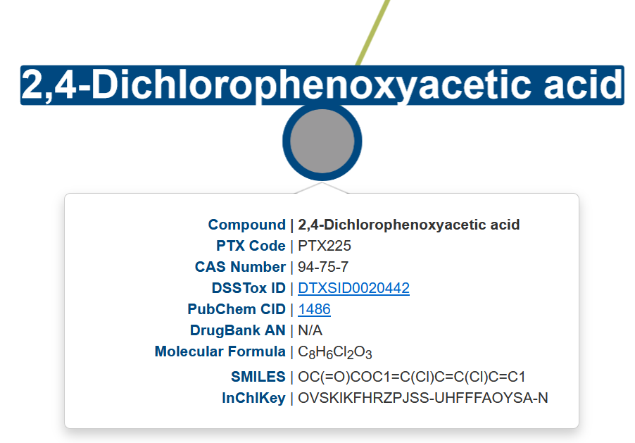

# PrecisionTox Chemical Visualization Tool

The PrecisionTox Chemical Visualization Tool is a web-based application developed
to facilitate the exploration and analysis of the [PrecisionTox](precisiontox.org) chemical collection.

:link: https://dex.precisiontox.org/chem/

## Description

### Chemical classification view

An interactive network that allows users to visualize how chemicals are classified according to two main categories:  **Use** and **Toxicity Endpoint**. 

Each node represents a category within the selected classification system. Upon clicking on any of these nodes, all chemicals associated to that particular category will be revealed.

These chemicals are simultaneously displayed in tables (one for each category) below the graph, providing a clear and organized view of the corresponding entries.

In addition, clicking on any chemical node will show a tooltip box displaying all compound identifiers.

### Single chemical properties view

Users can select a specific chemical using the search box, dropdown menu, or directly clicking on the corresponding link in the table. This will load a single chemical network view that displays all collected information for the selected compound.

This new network displays several nodes representing all main attributes: use and toxic endpoint categories, physicochemical properties, mechanisms of action, baseline toxicity data, molecular targets and adverse outcome pathways. Each can be clicked to display all corresponding data which will be shown in additional child nodes.

For further convenience, chemical information is also displayed in a structured table format beneath the graph. 

### Chemical collection table

Finally, the web application includes a comprehensive table listing the entire chemical collection. This table consolidates all available data for each chemical into clearly defined columns. Users can filter and sort the table as needed to support targeted analysis, as well as download it in different formats.

